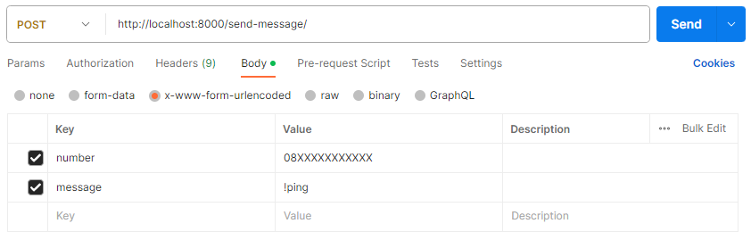
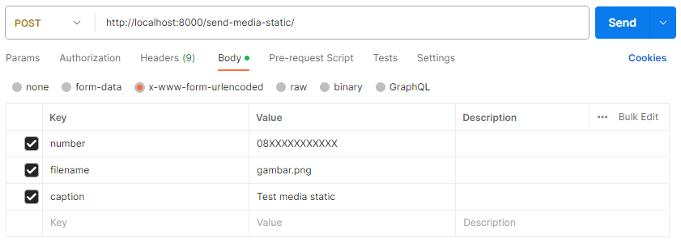
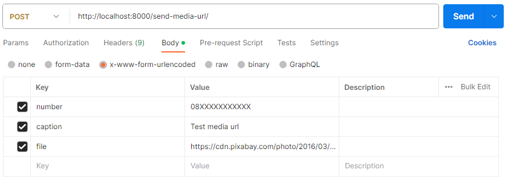

# api-whatsapp-web-nodejs
NodeJs API Whatsapp Web

## Description
Hanya berupa code dari sisi server. Berupa service 3 endpoint:
 - send message
 - send media static
 - send media url

## Installations
[wwebjs](https://wwebjs.dev/), [nodemon](https://www.npmjs.com/package/nodemon), [express](https://www.npmjs.com/package/express), [express-validator](https://www.npmjs.com/package/express-validator), [axios](https://www.npmjs.com/package/axios)
```sh
npm i whatsapp-web.js
```
```sh
npm i qrcode-terminal
```
```sh
npm i nodemon
```
```sh
npm i express
```
```sh
npm i express-validator
```
```sh
npm i axios
```

## Intructions
 - Download /clone file
 - Run project `npm start`
 - Run POSTMAN
   
   ```sh
   http://localhost:8000/send-message/
   ```
   

   ```sh
   http://localhost:8000/send-media-static/
   ```
   

   ```sh
   http://localhost:8000/send-media-url/
   ```
   
